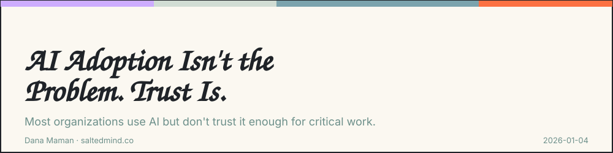

*2026-01-04*

About 75% of organizations use it in at least one function. And yet, most companies still don’t trust it enough to run anything critical. That contradiction explains almost every AI failure story you hear.

**The uncomfortable truth is this: better AI models rarely fixes adoption. It is actually the other way around. Better adoption fixes the AI dissonance.**

**While AI pilots are easy to launch, scaling for real value is a much steeper climb.** Across industries, many initiatives stall after early demos. Not because the models are bad, but because the organization isn’t ready. Data is fragmented. Ownership is unclear. And no one knows who’s accountable when the model is wrong.

**Transparency is the bridge here**; it builds trust by making these limits and responsibilities explicit. Explainable systems show how decisions are made, where models fail, and exactly where humans must step in. Black boxes kill confidence (also true for personal relationship).

**Hands-on training** matters because awareness doesn’t change behavior. When teams are involved early, they surface real blockers before those blockers quietly kill momentum.

Leaders know this tension. Investment is still rising. Long-term belief remains strong. But short-term results are uneven, and frustration is growing. **The bottleneck is no longer initial adoption; it’s operational execution.**

In 2026, the teams that win won’t be the loudest AI evangelists. They’ll be the ones that treat trust as infrastructure and execution as the real innovation.

I’d love to hear your perspective on this. Share your thoughts in the comments. If this resonated, pass it on to someone who needs it and feel free to subscribe for more.

**Dana Maman** is an AI Builder & Instructor · Strategic Consultant · Product Manager · NLP Practitioner

[www.saltedmind.co](http://www.saltedmind.co/)

---

Tags: ai-adoption, trust, organizations, strategy

Original: [https://saltedmind.substack.com/p/ai-adoption-isnt-the-problem-trust](https://saltedmind.substack.com/p/ai-adoption-isnt-the-problem-trust)
