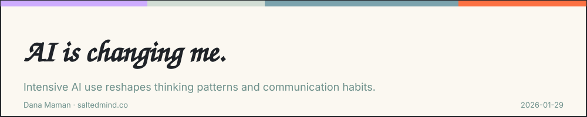
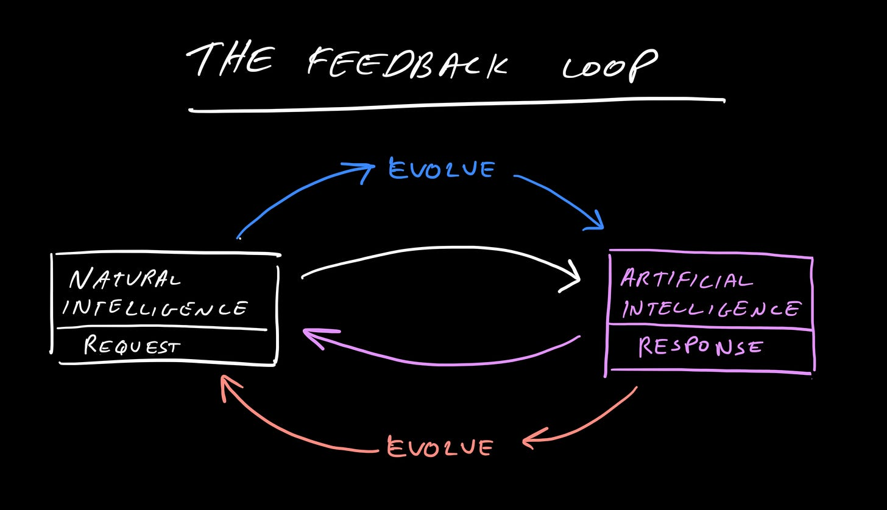

*2026-01-29*

I started noticing something unexpected. My thinking patterns shifted. My communication changed. I mean in real life, with biological humans.

This part rarely shows up in conversations about AI.

We talk endlessly about how AI learns from us. That’s true by design. Models improve by absorbing human input, becoming more like natural intelligence, just at much higher speeds.

What we talk about less is how we change in return.

Not intentionally. Not consciously. Just by using it frequently. Personally, I started feeling it after using AI tools intensively for more than a year, but I assume this is individual.

So what has changed?

I’m more explicit now. I give better context. I don’t assume understanding. I ask better questions. I expect clarity, first from myself, then from others. I even listen better.

There’s a downside. I’m less patient with inefficient, prolonged communication. That tendency always existed, and now it is amplified.

This didn’t happen overnight. It happened through repetition.

Through constant interaction and refinement with an internal expectation of improvement and growth.

Ray Kurzweil imagined human–machine merging as a technological event. Interfaces. Computation. Hardware.

What I’m experiencing feels like a softer version of that future. Individual. Subtle. Already underway.

I’m trying to imagine this impact at scale. When all of us change.

I’d love to hear your perspective on this. Share your thoughts in the comments. If this resonated, pass it on to someone who needs it and feel free to subscribe for more.

---

**Dana Maman** is an AI Builder & Instructor · Strategic Consultant · Product Manager · NLP Practitioner\
[www.saltedmind.co](http://www.saltedmind.co/)

---

Tags: personal-practice, ai-strategy, reflection

Original: [https://saltedmind.substack.com/p/ai-is-changing-me](https://saltedmind.substack.com/p/ai-is-changing-me)
