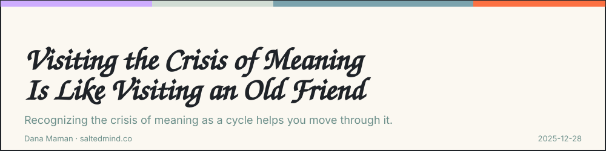
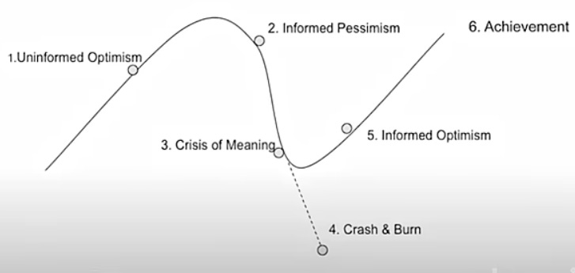

*2025-12-28*

I recently came across this [model of the Entrepreneur Journey by Alex Hormozi](https://open.spotify.com/episode/4XymgXUUeQgoP84Xktq4Vc?si=ba84c75c25724d83):

1.  **Uninformed Optimism** – Fired up and full of ideas. Everything feels possible… because you don’t know what’s coming.

2.  **Informed Pessimism** – Reality hits. It’s harder than it looked. Doubts sneak in.

3.  **Crisis of Meaning** – Overwhelmed. Burned out. Ready to quit. Most give up here.

4.  **Crash or Survive** – You either fold… or fight. Adapt. Learn. Grind.

5.  **Informed Optimism** – You’ve failed, learned, and leveled up. Strategy replaces guessing.

6.  **Growth & Momentum** – Systems. Profit. Scale. You’re no longer surviving - you’re thriving.

Most of the focus is on vision, strategy, and frameworks. All the surface tools that assume you’re already engaged and moving.

But the real breaking point is Stage 3: the crisis of meaning. The moment when you know exactly what to do, you have the plan, you have the resources, and yet you can’t bring yourself to take the next step. Your conscious mind knows the goal. Your unconscious mind has checked out.

I’ve been there more times than I can count. That’s why I call it an old friend. Each time it shows up, I recognize it faster. The need to re-ignite the meaning and reason I’m doing what I do. Why does it matter? The familiarity doesn’t make it easier, but it makes me better equipped to handle it.

When I stepped into independence and building my own thing, I knew I’d be driving into hectic highways and muddy rural roads. I needed a way to steer better. Four-wheel drive for motivation and consistency.

So, in addition to the many tools I’ve acquired over the years, I became an NLP practitioner and now use certain elements of this method that resonate with my knowledge and experience for two reasons:

**One:** To learn the mind patterns of high-performance people, and use those principles to rewire my perception and abilities when needed. To overcome the meaning crisis better and faster.

**Two:** To help others do the same. Achieve their goals. Improve their lives.

So far, it’s proven to be an effective and interesting tool - both for myself and for the people I guide.

The crisis of meaning will visit again. It always does. But now I have the tools to recognize it, sit with it, and use it as fuel rather than let it become a dead end.

Because knowing what to do has never been the hard part. The hard part is engineering yourself to want to do it.

[Watch on YouTube](https://www.youtube.com/watch?v=Kl-I7sUcAOY)

---

**Dana Maman** is an AI Builder & Instructor · Strategic Consultant · Product Manager

[www.saltedmind.co](http://www.saltedmind.co/)

---

Tags: entrepreneurship, personal-practice, growth

Original: [https://saltedmind.substack.com/p/keep-on-going](https://saltedmind.substack.com/p/keep-on-going)
