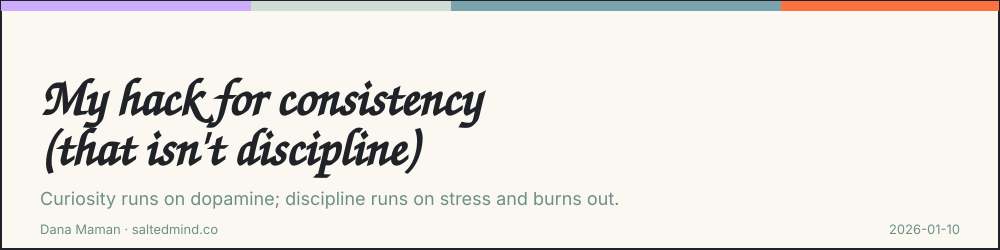
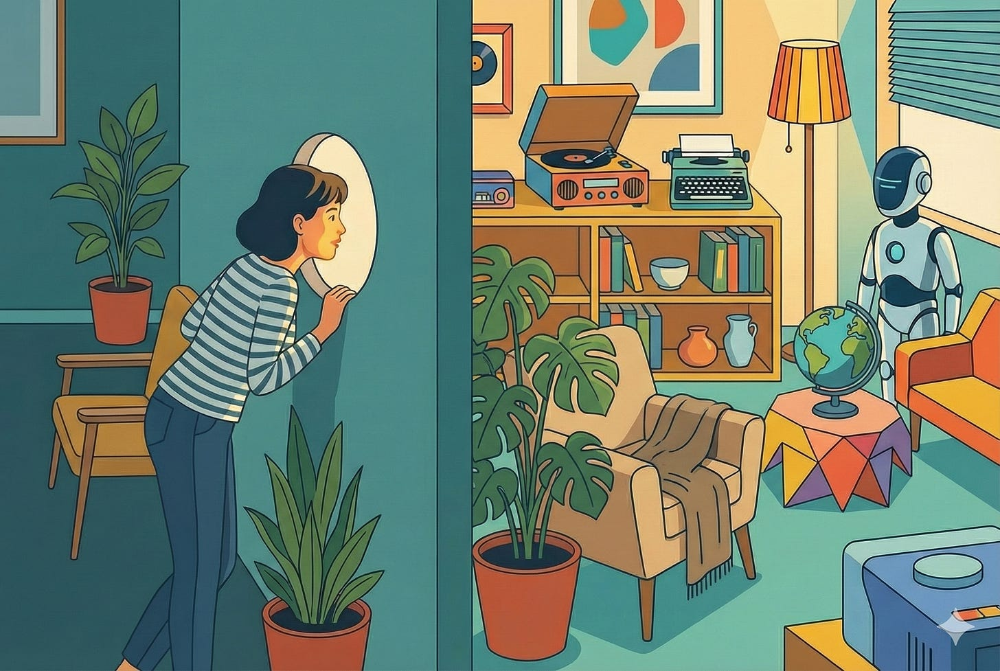

*2026-01-10*

Perhaps it’s the rebellion side in me. Or maybe it’s the healthy, loving one. Nonetheless, I refuse to adopt a habit by using discipline.

So when I want to eat healthier, swim regularly, write, build and ship more products, I need to find a way to “stay into it” for the long run.

I investigate it with full power. First of all, myself. What’s motivating me? I experiment and get feedback. And simultaneously, I research the biological, psychological, and historical aspects.

## The Dopamine Loop

Why not discipline? Because every time you force yourself to do something you don’t want to do, you’re burning through a finite reserve of mental energy.

Discipline relies on norepinephrine. That’s stress, effort, the biological “push.” You know the feeling. Gritting your teeth through a workout. Dragging yourself to write when you don’t want to. It’s exhausting because you’re literally fighting your own resistance. It works for short bursts. But as a long-term strategy for consistency? It fails. Not because you’re weak. Because biology doesn’t scale that way.

On the other hand -

**Curiosity** runs on something different. Dopamine. Pursuit. Reward. The biological “pull.” When you’re curious, the brain releases dopamine and suddenly you lean in. Time distorts. Effort feels effortless. The same task that drained you under discipline becomes engaging under investigation.

This isn’t motivational speak. It’s how the system actually works.

I’ve tested this across everything. In my business, I stopped telling myself “I should write articles to create social presence” and started asking “What actually resonates with my audience? What will come out of me after 30 days straight of writing every day?” Content creation shifted from obligation to experiment. I started writing not because I had to, but because I wanted to see what would happen.

With health, I changed “I have to work out” to “I’m testing what my body can do.” The pool became a research project instead of a chore. Some days I test speed. Some days I test endurance. Some days I just investigate how different movements feel. The consistency came naturally because I was curious about the answer.

When building AI products, I sometimes test best practices, sometimes creativity, and sometimes speed over perfection, and I keep going, so passionate to learn and build that I have to convince myself to go to sleep.

#### Reframing

The moment you shift your internal language from necessity (”I must”) to possibility (”I’m exploring”), the biology changes. The effort cost drops. The consistency becomes sustainable. Try it.

---

**Dana Maman** is an AI Strategist & Builder · [www.saltedmind.co](http://www.saltedmind.co/)

---

Tags: discipline, habits, personal-practice, motivation

Original: [https://saltedmind.substack.com/p/my-hack-for-consistency-that-isnt](https://saltedmind.substack.com/p/my-hack-for-consistency-that-isnt)
