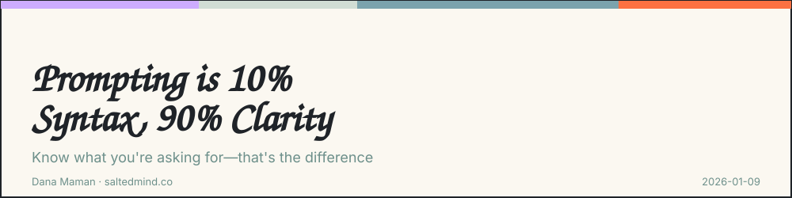
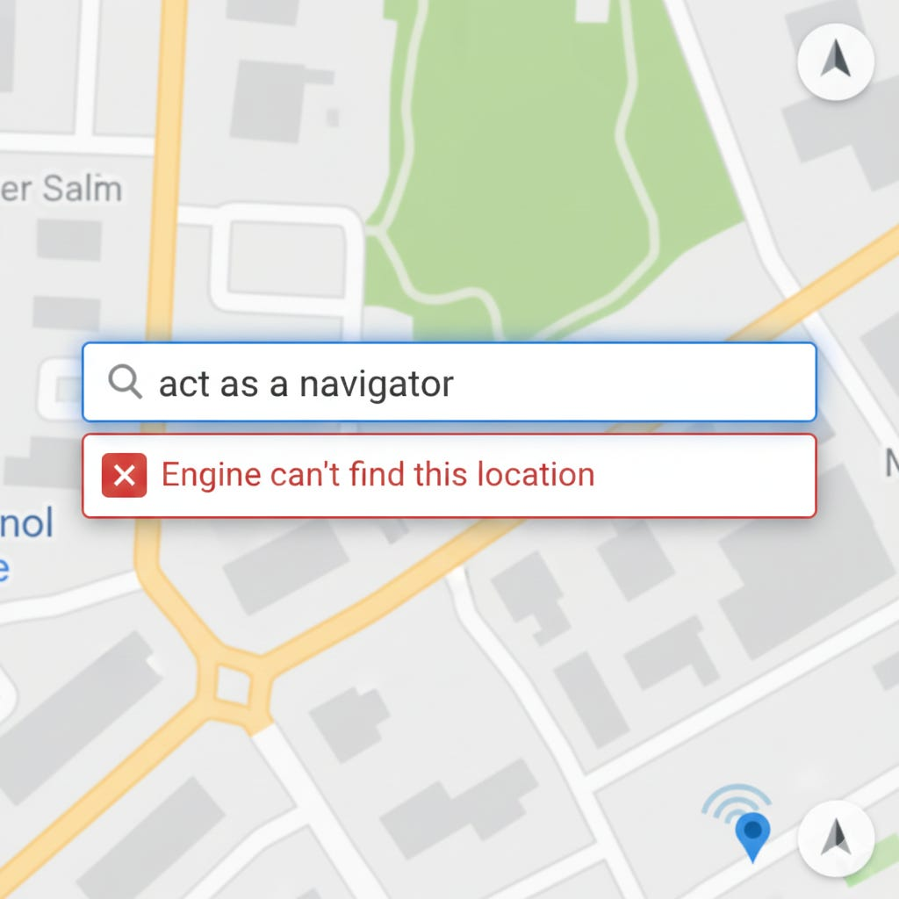

*2026-01-09*

You don’t need a certification in prompt templates. You need to know what you’re asking for. The people getting the best outputs from AI aren’t the ones who memorize delimiters and XML tags, they’re the ones who already knew how to brief a designer, write a creative brief, or explain a technical problem to an engineer without seven follow-up Slack messages.

Good prompting is just good communication dressed up in angle brackets. If you can’t explain your intent to a junior hire without confusing them, adding “Act as a...” to the beginning won’t fix it. The model is a mirror. It reflects the clarity (or chaos) of your thinking back at you with unsettling precision.

The irony is that everyone obsessing over prompt frameworks is optimizing the wrong variable. The syntax is trivial. The hard part is knowing what problem you’re solving, what good looks like, and what context actually matters. If you can do that, the prompt writes itself. If you can’t, no amount of role-playing preamble will save you.

I’d love to hear your perspective on this. Share your thoughts in the comments. If this resonated, pass it on to someone who needs it and feel free to subscribe for more.

**Dana Maman** is an AI Builder & Instructor · Strategic Consultant · Product Manager · NLP Practitioner

[www.saltedmind.co](http://www.saltedmind.co/)

---

Tags: prompting, clarity, ai-strategy, communication

Original: [https://saltedmind.substack.com/p/prompting-is-10-syntax-90-clarity](https://saltedmind.substack.com/p/prompting-is-10-syntax-90-clarity)
