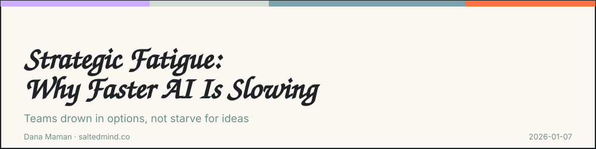
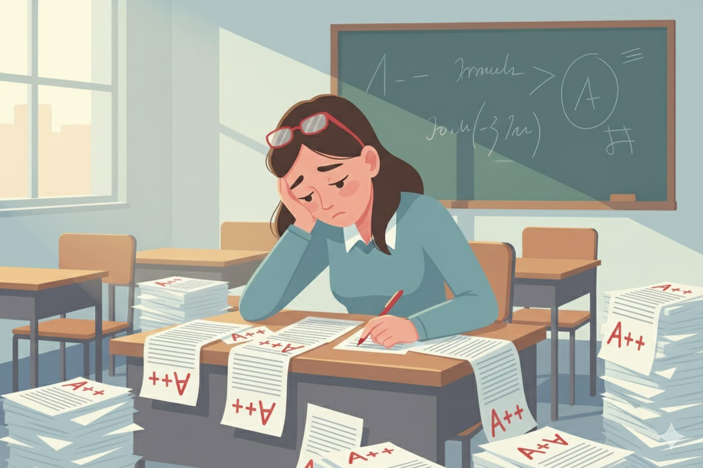

*2026-01-07*

AI is fast. Too fast.

Most teams are drowning in options, not starving for ideas. Every AI prompt spits out dozens of strategies, angles, and next steps. The result is not clarity. It is paralysis.

Here’s the mistake: leaders optimize for output speed instead of decision speed.

Your brain cannot process 1,000 options per minute. Neither can your team. When AI floods the system, people stop thinking critically and start approving things just to move on. That is operational debt.

Empowered teams need a clear “yes” and a clear “no.” If AI generates fifty strategies, your team loses its north star. Execution slows. Ownership disappears.

Fix it with three moves:

First, define non-negotiables before prompting AI. If an output breaks a rule, it never reaches a human. This alone removes most of the noise.

Second, review AI-heavy work only during your best thinking windows. When energy is low, judgment is weak, and bad decisions slip through.

Third, use AI to critique AI. Run a second agent whose only job is to tear apart the first output. By the time it reaches you, only the strongest ideas survive.

AI does not fail because it is weak. It fails because leaders do not filter hard enough.

I’d love to hear your perspective on this. Share your thoughts in the comments. If this resonated, pass it on to someone who needs it and feel free to subscribe for more.

---

**Dana Maman** is an AI Strategist & Builder

[www.saltedmind.co](http://www.saltedmind.co/)

---

Tags: decision-making, ai-strategy, leadership, cognitive-load

Original: [https://saltedmind.substack.com/p/strategic-fatigue-why-faster-ai-is](https://saltedmind.substack.com/p/strategic-fatigue-why-faster-ai-is)
