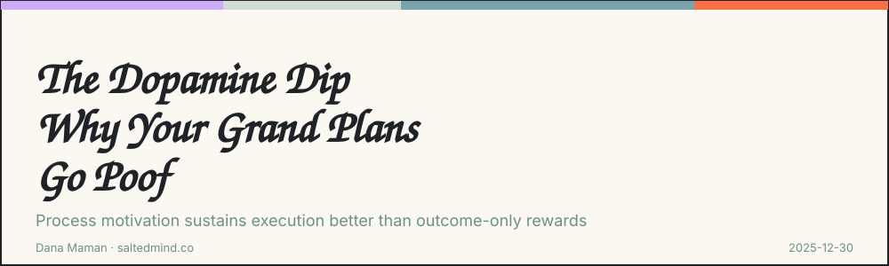

*2025-12-30*
> *“*Learn to spike dopamine from effort itself: focusing only on the reward at the end of effort can undermine the process, making the process feel more painful and time feel longer”. \[[Huberman](https://open.spotify.com/episode/42F7z6Z4CB8hJAstRqMCiV?go=1&sp_cid=57480bd34d214ce2e0314a62168aa700&utm_source=embed_player_p&utm_medium=desktop)\]

That’s Huberman explaining why most of us quit our New Year’s resolutions by February. We tie motivation to the finish line - the body, the promotion, the completed project. But dopamine doesn’t wait for outcomes. It rises when effort itself feels meaningful and progress is visible.

**The Fix**

Strong strategy works the same way. It sustains purpose during execution, not just at the end. It creates frequent progress markers, acknowledges effort in real time, and reconnects tasks to the why. It helps people see who they’re becoming, not just what they’ll deliver.

When dopamine generates during the work itself, momentum maintains itself.

**The Problem**

Most strategies crumble because they strip away the meaning that fuels human motivation. You won’t see dopamine mentioned in a strategic plan, yet it determines whether people start, persist, and complete the work.

Organizations build alignment. They involve stakeholders, gather input, make sure no one feels blindsided. But they overlook what actually determines whether execution holds: the team’s internal chemistry.

If people don’t understand why the work matters at a level that stays alive day-to-day, the strategy loses its pull. Leaders call it resistance. Biology disagrees. Strategies that rely on a single reward at the end or strip tasks of context drain people, even when they keep going.

If your strategy isn’t clarifying and sustaining the why, it’s quietly undermining its own success.

---

**I’d love to hear your perspective on this. Share your thoughts in the comments. If this resonated, pass it on to someone who needs it and feel free to subscribe for more.**

---

**Dana Maman** is an AI Strategist & Builder

[www.saltedmind.co](http://www.saltedmind.co/)

---

Tags: motivation, habits, strategy, personal-practice

Original: [https://saltedmind.substack.com/p/strategy-and-dopamine](https://saltedmind.substack.com/p/strategy-and-dopamine)
