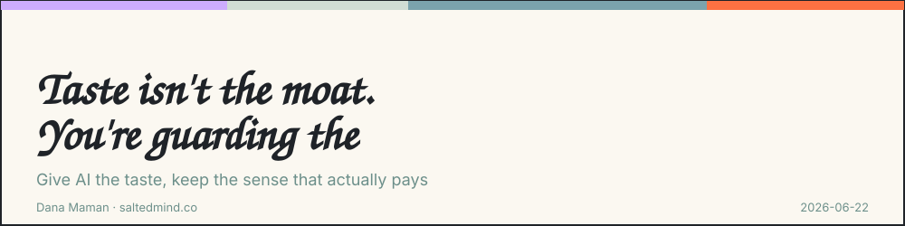

*2026-06-22*

*\[Hebrew version in the first comment\]*

Everyone says taste is the new moat.

They’re selling you the part that’s already being automated.

Here’s the move nobody’s making: hand AI the taste, keep the part that actually pays — and stop confusing the two.

Because taste and sense are not the same thing. And the difference is your whole job now.

**Taste is a verdict.** It answers one question: is this output good? **Sense is an aim.** It answers a different one: is this even worth making?

Watch the gap:

→ Taste says: “this landing page looks cheap, fix the spacing.” Sense says: “we don’t need a landing page. We need a WhatsApp message to 12 people.”

→ Taste says: “this chatbot’s answers are off.” Sense says: “the tasteful version isn’t a chatbot. It’s a button.”

→ Taste says: “this report reads well.” Sense says: “nobody asked for a report. They asked for a decision.”

Taste judges what got made. Sense decides what’s worth making. One happens after the work. One happens before there’s any work to judge.\
In real expert work they bleed into each other, but I’m keeping them clean here so we can design around the split.

Now the part nobody tells you:

**Taste converges. Sense doesn’t.**

Taste is your verdict against a baseline — and the baseline rises on its own. Every model release, the default output gets more tasteful while you sleep. So your taste isn’t a wall you build once and defend. It’s a lead that shrinks every few months whether you do anything or not.

Sense doesn’t converge, because sense means being accountable for the problem — and a model has no problem of its own. It will build you the most beautiful version of the wrong thing, every time, and never feel the cost.

So stop guarding your taste. Build it into your setup, let the machine run it, and spend your human hours on sense.

But first, the objection you’re already thinking:

**“Taste is tacit. You can’t write it down.”**

Correct. And you don’t have to.

Here’s what tacit actually means: you can’t state the rule in advance, but the moment something’s in front of you, you can tell if it’s good. Taste isn’t a spec you author. It’s a *reaction* you have. “I know it when I see it” isn’t a cop-out — it’s a feedback function. Input, output, your verdict.

Which means the thing you can’t write down, you *can* capture — because **every reaction is a label.** You don’t define your taste for the machine. You react, and the machine collects your reactions until it can predict them. Tacit knowledge resists definition. It does not resist feedback.

So don’t write a rulebook. Close a loop.

**Build the loop (3 steps, do it today):**

1.  **Seed it with receipts, not adjectives.** Paste three things you’d ship and three you’d kill — each with one line: *why*. “Clean,” “premium,” “modern” are useless; the model already has those. What it doesn’t have is the gap between your six examples. That gap *is* your taste, and it’s the only thing it can’t get anywhere else.

2.  **Make the AI score itself before it reaches you.** Bottom of the file: “Before you show me anything, check it against my examples. Tell me which line it fails and why.” Now nothing hits your eyes until it’s already passed your bar once. You stopped being the spell-checker. You became the appeals court.

3.  **React, and let the file remember.** Every time you kill an output, react back: “this failed, here’s the line it broke.” Every time you ship one, say why. The file doesn’t store rules — it stores your verdicts, and your verdicts harden into the bar. In a month it catches the misses you’d wave through on a tired day — because it never has a tired day, and it never forgets a call you made.

That’s the move: you don’t teach the machine your taste. You **become its feedback signal**, and the file is just the memory. The part everyone’s clinging to, running on a loop you close in passing.

One honest catch, so this isn’t sold as magic: **the loop is only as alive as your reactions.** The day you stop feeding it, your taste freezes at its last calibration — while the baseline keeps rising underneath it. You didn’t automate yourself away. You traded *making the thing* for *judging the thing*, and judging is now the job. The loop doesn’t remove you. It moves you to the one seat that still pays: the verdict.

And here’s where taste hands off to sense — the boundary the loop can’t cross. Feedback can only judge *what got generated*. It will perfect anything inside the frame and never once tell you the frame is wrong. You can thumbs-up a chatbot a thousand times and never get the note “this should’ve been a button.” That veto doesn’t come from taste. It comes from sense.

**Now protect the bigger part — your sense:**

This one has no file. But you can sharpen it.

1.  **Before you build, write the problem — not the solution.** One sentence. “People keep doing X by hand and it costs Y.” If you can’t write that sentence, you don’t have sense yet. You have a tool looking for a job.

2.  **Ask it out loud: should this exist?** AI will happily build you a beautiful thing nobody needs. Sense is the veto. The most tasteful chatbot in the world is still the wrong answer if the answer was a button.

3.  **Own the call.** Put your name on *why* you built it — not just that it looks good. That accountability is the one thing the model will never take from you. So make it the thing you sell.

**The bottom line:**

Taste is a file. Sense is a stance.

Automate the file. Defend the stance.

The moat was never taste — taste was always going to converge. The edge is sense. And now you have an afternoon’s worth of instructions to act like it.

> I’d love to hear your perspective on this. Share your thoughts in the comments. If this resonated, pass it on to someone who needs it and feel free to subscribe for more.
>
> **Dana Maman** is an AI Builder & Instructor · Strategic Consultant · Product Manager · NLP Practitioner
>
> [www.saltedmind.co](http://www.saltedmind.co/)

---

Tags: taste, judgment, ai-strategy, product

Original: [https://saltedmind.substack.com/p/taste-isnt-the-moat-youre-guarding](https://saltedmind.substack.com/p/taste-isnt-the-moat-youre-guarding)
