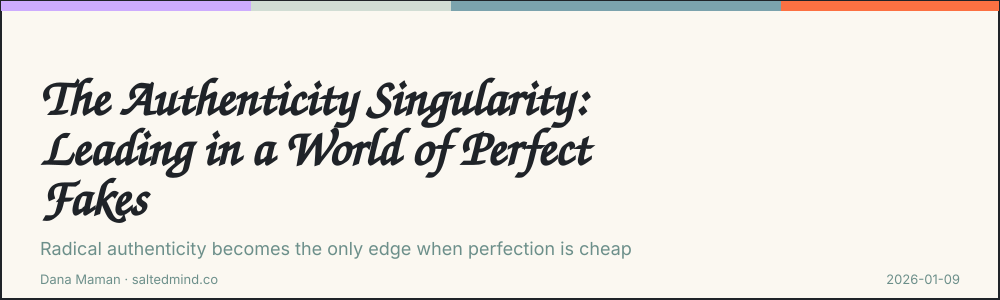

*2026-01-09*

I used to think authenticity was my superpower. Then I paid for it enough times that I started wondering if it was actually my biggest flaw. Being real, not playing the sterile corporate game, refusing to follow the unwritten protocol everyone else had memorized - it cost me. More than once…

But here’s what I’ve learned: the game is changing. The thing that used to be a liability is becoming the only advantage that matters.

## The Perfection Paradox

Ray Kurzweil predicted “The Singularity,” the moment machine intelligence surpasses human intelligence. As we move closer to that future, leaders are hitting a different threshold. Not technical. Cultural. Call it **The Authenticity Singularity -** the moment when synthetic perfection becomes so cheap and convincing that it loses all value.

When AI can generate flawless strategic roadmaps, polished LinkedIn posts, and perfectly scripted apologies, “perfection” stops signaling excellence. It signals automation. The only currency that holds value is the imperfect human story. Brené Brown has shown how vulnerability and human specificity shape real leadership. Our mistakes, our awkward edges, our personal weirdness: these are precisely what technology can’t mass-produce. At least not yet…

## Radical Transparency as Strategy

Being “perfect” doesn’t differentiate you anymore. It makes you blend in with the machine. Real strategy now requires **radical transparency** - not oversharing or performative vulnerability, but deliberate exposure of what usually stays hidden. The trade-offs, the failed experiments, the messy logic behind pivots.

If the surface of your leadership can be modeled by a language model, your advantage no longer lives there. The edge moves to what can’t be templated: irrational instincts, lived experience, emotional memory that no dataset contains.

The Japanese concept of wabi-sabi finds beauty in imperfection and things that show wear. Western business spent decades chasing the opposite - polish, perfection, the flawless pitch deck. Now machines do flawless better than we ever could. Proving you’re real became the new differentiator.

I still remember the time a VP I once worked under earned my trust more by sharing how he felt navigating a micromanaging boss than by leading us to a new revenue high.

## The Shift

What people trust now is the low-fidelity signal: raw, imperfect, immediate communication that carries human fingerprints. Don’t just present the decision - share the internal conflict that led to it. AI delivers answers. Humans deliver reasons.

Chase Hughes teaches that real truth leaks through the body before it shows up in words. In posture, micro-expressions, timing, tone. Machines can imitate language. They still struggle with embodied reality.

The Singularity may take our tasks. It may automate our outputs. But it can’t replace who we are. The Authenticity Singularity is a forcing function. It will accelerate the influence of leaders who are genuinely human and destroy the credibility of everyone else.

Choose accordingly.

---

**Dana Maman** is an AI Builder & Instructor · Strategic Consultant · Product Manager · NLP Practitioner\
[www.saltedmind.co](http://www.saltedmind.co/)

I’d love to hear your perspective on this. Share your thoughts in the comments. If this resonated, pass it on to someone who needs it and feel free to subscribe for more.

---

Tags: authenticity, leadership, ai-strategy, judgment

Original: [https://saltedmind.substack.com/p/the-authenticity-singularity-leading](https://saltedmind.substack.com/p/the-authenticity-singularity-leading)
