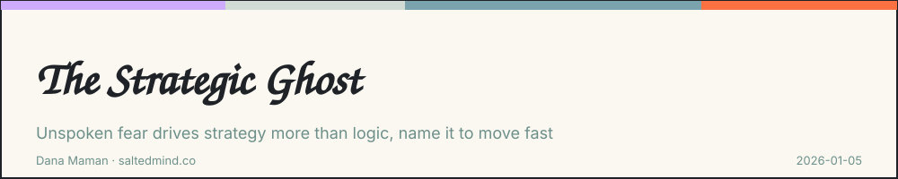

*2026-01-05*

It’s not on the agenda, but it drives the outcome.

Fear, insecurity, reputation risk, past failures, the need to protect a team or an identity. It shows up disguised as logic.

You see it when debates get oddly emotional, when someone goes silent, or when the group keeps circling the same “safe” option.

Most strategy frameworks treat this as noise. That’s a mistake.

Because the ghost is signal.

The best leaders don’t call it out aggressively. They surface it safely.

They ask one simple question before diving into options: what feels risky to say out loud?

They limit airtime so honesty feels contained, not exposed.

They silently reframe resistance as protection, not obstruction.

Once the ghost is acknowledged, it loses power. Decisions speed up. Quality improves.

Strategy fails less often from bad thinking and more often from unspoken fear.

Handle the human layer well, and the strategy gets dramatically better.

I’d love to hear your perspective on this. Share your thoughts in the comments. If this resonated, pass it on to someone who needs it and feel free to subscribe for more.

---

**Dana Maman** is an AI Builder & Instructor · Strategic Consultant · Product Manager · NLP Practitioner

[www.saltedmind.co](http://www.saltedmind.co/)

---

Tags: strategy, fear, leadership, decision-making

Original: [https://saltedmind.substack.com/p/the-strategic-ghost](https://saltedmind.substack.com/p/the-strategic-ghost)
