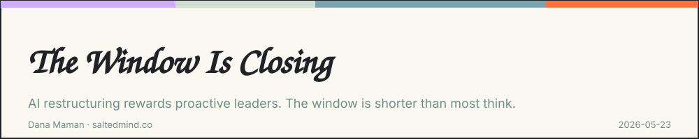
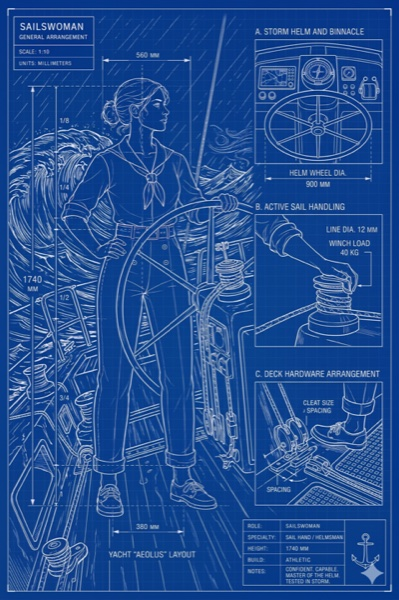

*2026-05-23*
*(Or: "The companies that do it proactively will define what comes next" — Zeb Evans, ClickUp CEO, May 2026)*

## Opening — the signal

Two days ago, the CEO of a $4B productivity company laid off 22% of his workforce. Not because the company was struggling. Because the math of how work gets done fundamentally changed, and he decided to act on it before a downturn forced him to.

Zeb Evans called it the "100x org." AI agents now outnumber ClickUp employees 3:1. The people who stayed got salary bands up to $1 million — not for their titles, not for their tenure, but for one thing: their ability to build and manage AI systems that produce 100x impact.

His line that should stop you cold: "Nearly every company will make these changes. The ones that do it proactively will define what comes next."

The ones that do it proactively.

This is the article about what that means — and why the window to be proactive is shorter than most people think.

## Part 1: The Half-Life Problem

AI skill doesn't have a normal learning curve. It has a half-life.

A technique that was advanced in early 2024 is table stakes by late 2025. A workflow that gave you an edge six months ago is now the baseline expectation. The advantage isn't in learning the tool — it's in deploying it while everyone else is still watching the tutorial.

This sounds like anxiety. It isn't. It's actually the most optimistic thing about this moment: the ramp to real proficiency is shorter than it's ever been. You don't need to learn to code. You don't need a data science degree. You need to do two things that most people are skipping:

Get specific about what you actually do — in enough detail that an AI can act on it
Build a system around that specificity, not just open a chat window

The people who've done those two things in the past 12–18 months are not simply faster. They are operating in a different category. Not because their AI is better — the models are nearly identical. Because their context is better. They've built the thing nobody can copy: a structured record of their own judgment, preferences, and domain expertise that an AI can actually use.

That's the moat. And it compounds every week you add to it.

## Part 2: What ClickUp Actually Proved

The standard reading of the ClickUp announcement is "AI is replacing jobs." That's the wrong read.

ClickUp proved something more interesting and more uncomfortable: the restructuring is already priced in — the only variable is who controls it.

Evans didn't wait for a downturn. He didn't wait for the board to force the conversation. He designed the new structure on his terms, with the resources to do it right: generous severance, genuine investment in the people who stayed, a clear framework (builders, system managers, front-line) for what the future organization actually looks like.

The companies that wait — and most will wait — will make the same restructuring under worse conditions. Budget pressure, a bad quarter, a reorg that gets announced on a Tuesday with no framework and no clarity. Same outcome, much less control.

The question for every leader reading this isn't "will we need to change?" It's "do we want to be ClickUp in May 2026, or the unnamed company in a down market two years from now?"

## Part 3: The Risk of Passive Adoption

There's a version of AI adoption that looks active but isn't. It's the version where you subscribe to the right tools, encourage your team to use them, see productivity improvements in individual tasks, and call it done.

This is passive adoption. And it's the most dangerous position to be in — because it feels like you're doing something.

What passive adoption misses:

It optimizes tasks, not structure. Your team writes emails 30% faster. Your analysts summarize reports in minutes. But the organizational design — who owns what, how decisions flow, where the real bottlenecks are — stays the same. You've made the old structure more efficient. You haven't built the new one.

It doesn't encode judgment. The real leverage in AI isn't speed. It's the ability to transfer your best thinking — your frameworks, your decision criteria, your institutional knowledge — into systems that work without you. Passive adoption uses AI as a faster keyboard. Active adoption uses it as an extension of judgment.

It creates a false sense of readiness. The companies that will be surprised by restructuring pressure are almost all currently using AI. They're just using it at the wrong layer.

## Part 4: What Proactive Actually Looks Like

Not a technology roadmap. Not a budget line. Three concrete things:

**1. Audit your work for what AI already makes unnecessary**
Nate B. Jones calls it the four-bucket test: Theater (visible but low value), Commodity (real but AI-replaceable), On the line (needs repositioning), Durable (judgment, relationships, synthesis). Most people haven't done this audit honestly. The useful question isn't "will AI replace me?" — it's "how much of my last two weeks still needed me?"

**2. Build context before you build workflows**
You cannot deploy an AI that does useful work for your company until you've done the hard thing: articulating what you actually know, how you actually decide, what actually matters. This is not a documentation project. It's a strategic asset. The companies that will look back on 2025–2026 as a turning point are the ones that spent this period building that asset, not just using better tools.

**3. Design the structure, don't just adapt to it**
Evans named three roles in the new org: builders, system managers, front-line. That's a framework. You don't have to copy it — but you do have to have one. What does your org look like when agents do the commodity work? Which roles need to shift toward direction and oversight? Who owns the AI systems, and what does accountability look like? These are design questions. The answer isn't "we'll figure it out as we go" — that's the passive path.

## Close

The window to do this proactively — on your terms, with your team intact, from a position of strategic choice rather than financial pressure — is not permanent.

Evans had the timing right: "The ones that do it proactively will define what comes next."

The half-life of AI advantage is six months. The restructuring pressure that follows passive adoption arrives on a schedule you don't control.

The question is not whether your company will change. It's whether you'll be the one designing the change — or the one explaining it.

---

## Sources

- ClickUp cuts 22% of staff, offers $1M salaries in AI restructuring
- Outnumbered: At $4 billion ClickUp, a 3:1 agent-to-human ratio is rewiring work itself
- ClickUp's 100x org — StartupHub

---

Tags: ai, strategy, organizations, leadership

Original: [https://saltedmind.substack.com/p/the-window-is-closing](https://saltedmind.substack.com/p/the-window-is-closing)
