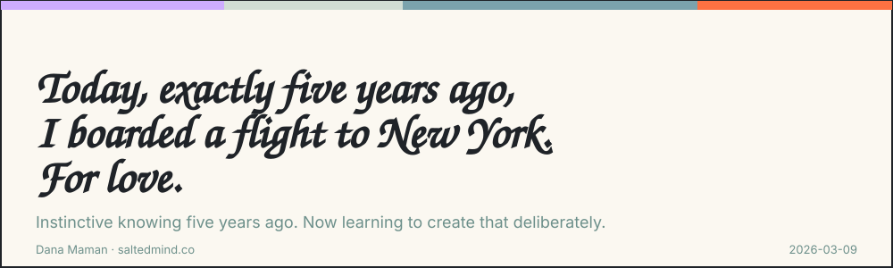
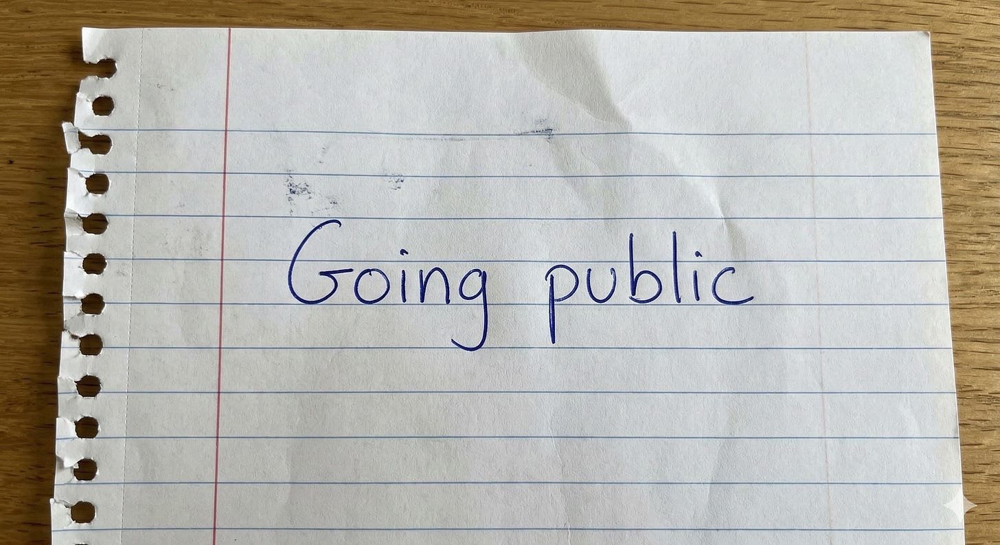

*2026-03-09*

*\[Hebrew below\]*

I am not sure I can do it. So I go ahead and do it.

Today, exactly five years ago, I boarded a flight to New York. For love.

It was hardcore COVID times. Every government office shut down - no way to renew a passport. The US Embassy closed - no way to get a visa. Ben Gurion Airport basically shut down for flights. And still, I had absolute clarity that I was going to go see her, and I wasn’t going to let “facts” that said otherwise get in my way. I just *knew*.

I’m thinking about this now. A few months after launching Salted Mind - my home for strategy and AI. A place where I bring together natural intelligence, artificial intelligence, and awareness.

For years I wanted to build something of my own and never dared. And here I am.

It would make a better story if I told you I had that same level of knowing when I launched my business - but honestly, I didn’t. (Doubts and fears, though? Those I had plenty of.)

Fast forward to today - I’m doing really well and genuinely happy with what I’ve built. At the same time, I notice there are things I’m treating as impossible, and I feel like my growth is being limited by my ability to *imagine* how far I can actually go. \[Side note: I see this with my clients too, and I always make sure we stretch the boundaries of “what’s possible” before we start analyzing optimal choices - not the other way around.\]

So alongside everything happening in this part of the world, I’m trying to figure out how to imagine further - and how to deliberately create that unstoppable *knowing* I had when I was getting ready for that New York trip. I think combining those two abilities leads to something extraordinary. Greatness. I don’t have all the answers yet, but I feel like every day I don’t do something because of hesitation or self-doubt is a day wasted.

So I’m running an experiment. Every day I’ll do something I’m not sure I can pull off. (This post is step one, by the way.)

I opened a WhatsApp group on the topic - there’s still room for 1,022 more people.

Comment “GREATNESS” and I’ll send you the link.

*.Comment “Tell me what happened with that love story”* and I’ll send you that too*.*

> I’d love to hear your perspective on this. Share your thoughts in the comments. If this resonated, pass it on to someone who needs it and feel free to subscribe for more.

---

> **Dana Maman** is an AI Strategist & Builder\
> [www.saltedmind.co](http://www.saltedmind.co/)

---

*\[This text, unlike texts before, was originally written in Hebrew and translated to English. See the Hebrew version below.\]*

---

היום, לפני חמש שנים בדיוק, עליתי לטיסה לניו-יורק בעקבות האהבה.

הימים הם ימי קוביד הארד קור. כל משרדי הממשלה סגורים בלי אפשרות לחדש דרכון, שגרירות ארה״ב סגורה בלי אפשרות להוציא ויזה ונתב״ג סגור לטיסות. ובכל זאת, יש לי בהירות מוחלטת שאני נוסעת לפגוש אותה ואני לא מתעסקת ב״עובדות״ שאומרות אחרת. יש לי ידיעה.

אני נזכרת בזה עכשיו. כמה חודשים אחרי שהקמתי את Salted Mind - הבית לאסטרטגיה ו-AI. מקום שבו אני משלבת בין בינה טבעית, בינה מלאכותית ומודעות.

שנים רציתי להקים משהו משלי ולא העזתי. והנה אני כאן.

זה יכול היה להיות סיפור טוב אם הייתי אומרת שהייתה לי את אותה רמה של ידיעה כשהקמתי את העסק שלי, אבל האמת היא שלא הייתה לי (ספקות וחששות לעומת זאת, דווקא כן היו לי).

פאסט פורוורד להיום - אני מצליחה מאוד ושמחה מאוד על מה שיש. במקביל, אני שמה לב שיש דברים שאני תופסת כבלתי אפשריים ואני מרגישה שיכולת הצמיחה שלי מוגבלת ביכולת לדמיין לאן אני יכולה להגיע. \[אגב, אני רואה את זה גם אצל הלקוחות שלי ומוודאה שאנחנו מותחים את הגבולות של ״מה אפשרי״ לפני שמנתחים מהן הבחירות האופטימליות ולא להיפך.\]

אז יחד עם כל מה שקורה באיזור הזה של העולם, אני מנסה להבין איך לדמיין רחוק יותר ואיך ליצור באופן מכוון את אותה ״ידיעה״ בלתי ניתנת לעצירה שהייתה לי כשהתכוננתי לנסיעה ההיא לניו-יורק? אני חושבת שהשילוב בין שתי היכולות האלו מביא לנפלאות, גדולה, כבירות. Greatness. ואמנם אני לא יודעת את התשובות, אבל מרגישה שכל יום שבו אני לא עושה משהו בגלל הססנות או ספק ביכולות שלי, הוא יום מבוזבז.

אז אני יוצאת לניסוי. כל יום אעשה משהו שיש לי ספק שאני יכולה לעשות (הפוסט הזה הוא הצעד הראשון, אגב).

פתחתי קבוצת וואטסאפ בנושא ובינתיים יש בה מקום לעוד 1022 אנשים.

כתבו בתגובה ״גרייטנס״ ואשלח קישור לקבוצה.

כתבו לי ״ספרי מה עלה בגורלה של האהבה ההיא?״ ואשלח לכם

---

Tags: personal-practice, reflection, entrepreneurship

Original: [https://saltedmind.substack.com/p/today-exactly-five-years-ago-i-boarded](https://saltedmind.substack.com/p/today-exactly-five-years-ago-i-boarded)
