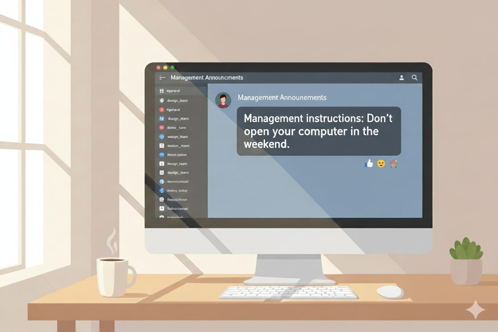

*2026-01-01*

The uncomfortable truth is that goals are cheap. Execution is expensive. And execution does not come from ambition. It comes from habits. Small, consistent behaviors that guide decisions when pressure, ambiguity, and distractions show up.

So ask yourself: what habit are you practicing today that keeps your company on course?

Because that habit, not the strategy deck, will decide whether your strategic plan gets executed or quietly ignored.

---

**Dana Maman** is an AI Strategist & Builder

[www.saltedmind.co](http://www.saltedmind.co/)

---

Tags: habits, execution, leadership, strategy

Original: [https://saltedmind.substack.com/p/what-habit-are-you-as-ceo-building](https://saltedmind.substack.com/p/what-habit-are-you-as-ceo-building)
