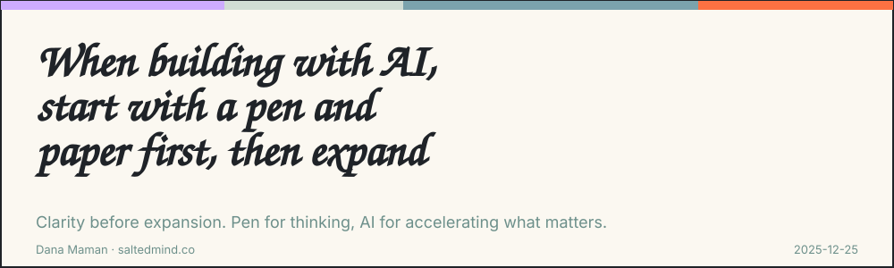

*2025-12-25*

A solo entrepreneur reached out to me yesterday for guidance on building an AI-based app. My first instruction surprised them:

**Start with a pen and paper.**

I’ve spent years working as a **product manager and strategic consultant**, and over the last couple of years I’ve become deeply **passionate about AI** - spending my days (and nights) experimenting, building, teaching, and helping others apply it in real products.

That’s exactly why I insist on this starting point.

Brainstorming is the art of **expansion and focus**. Starting with AI feels efficient, but it often sends us in the wrong direction. I fall into this trap myself - generating, refining, and improving things that shouldn’t exist to begin with. AI expands possibilities before we’ve chosen what actually moves the needle.

So I reverse the order and start with clarity.

For big projects or deep thinking, I work offline (or in Miro). I take a large sheet of paper and create a mind map - laying out thoughts, directions, goals, and constraints. I add numbers to force prioritization and sequencing.

Only when the plan is visible do I open an AI tool - collaborating with it, accelerating the process, but never replacing my own judgment, product logic, or strategic reasoning.

AI is a powerful collaborator.\
But without clear thinking, it only amplifies noise.

---

### Why I’m writing here

I want to build a community of thinkers - people who want to understand themselves better while staying ahead of technology, trends, and awareness.

For the next 30 days, I’ll publish daily. I’ll write about ideas I encounter, how I interpret them, and what can be done with those insights. Topics will range from AI, strategy, and singularity to relationships, kids, longevity, Chinese medicine, diversity, everyday emotional and practical choices.

After 30 days, I’ll decide what this becomes.

For now, this is the beginning.

---

**Dana Maman is an AI Builder & Instructor · Strategic Consultant · Product Manager**

[www.saltedmind.co](http://www.saltedmind.co)

---

---

Tags: ai-strategy, brainstorming, focus, workflow

Original: [https://saltedmind.substack.com/p/when-building-with-ai-start-with](https://saltedmind.substack.com/p/when-building-with-ai-start-with)
