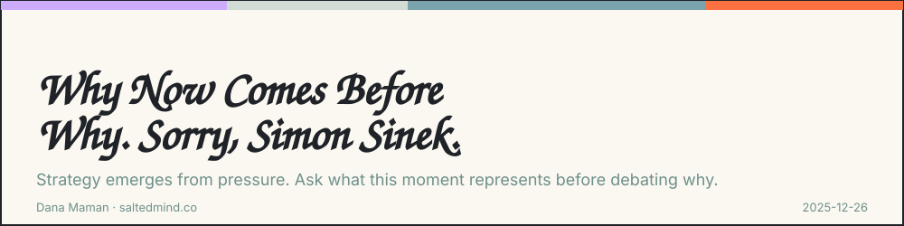
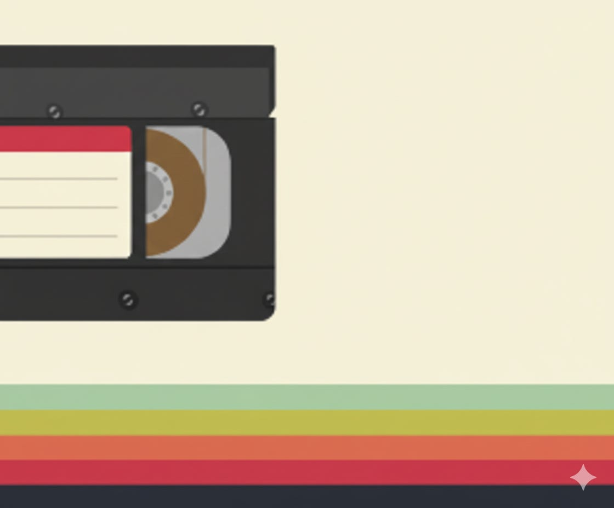

*2025-12-26*

Before starting any strategic work, I try to rewind the tape.

I don’t start with the problem. I start with the moment.

**Why is this coming up now?**

Because strategy doesn’t emerge in a vacuum. It emerges from pressure. A shift. A signal someone noticed and couldn’t unsee. And if you don’t name that pressure explicitly, it will quietly steer every decision you make.

When you ask what *this moment* actually represents, the conversation changes. You move from debating ideas to understanding intent. From surface-level disagreement to shared clarity.

Sometimes the answer is uncomfortable: fear, urgency, insecurity, impatience. But that’s exactly why it matters.

The clearest strategies come from being honest about the question behind the question.

---

> **Dana Maman is an AI Strategist & Builder**
>
> [www.saltedmind.co](http://www.saltedmind.co/)

---

Tags: strategy, decision-making, pressure

Original: [https://saltedmind.substack.com/p/why-now](https://saltedmind.substack.com/p/why-now)
